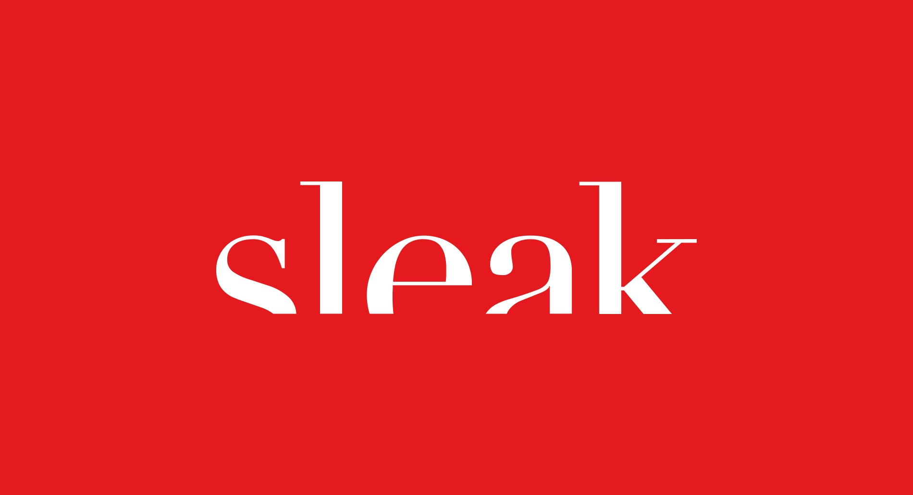

<h1 align="center">sleak-magazine</h1>

Website for German design magazine »sleak«.

&nbsp;  
&nbsp;  

## About

A ~~sleek~~ sleak design magazine, written, designed and developed by students from [University of Applied Sciences Bremerhaven](https://www.hs-bremerhaven.de/start/).  
The web version is built as a one-page design, with the next article being loaded automatially upon reaching the end of the current one.  
There also is a print version, which you can buy [here](https://sleak-mag.design/print).

## Instructions

### Develop

- Run development server: `npm run serve`
- Lint and automatically format code: `npm run lint`

### Build

> Note: This is only neccessary if you want to inspect what the production version looks like on your machine.  
>  When you deploy, this command will run _automatically_ before publishing.

- Build a production-ready version with minification etc.: `npm run build`

### Deploy

> Note: For obvious reasons, this requires write-access to this repository... 🔐

1. Make sure you're on the master branch and that all is up-to-date.
2. Ensure the version number in package.json is higher than that of [the last release](https://github.com/jonaskuske/sleak-magazine/releases)
3. Run `npm run deploy`
